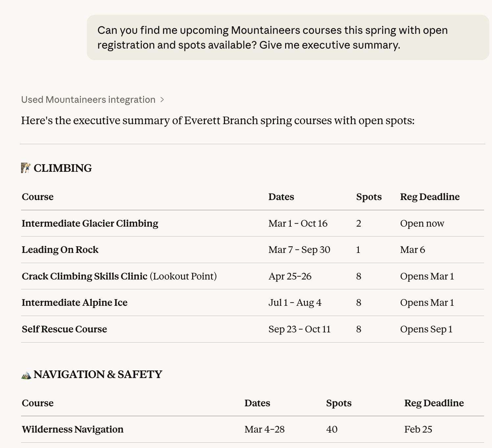
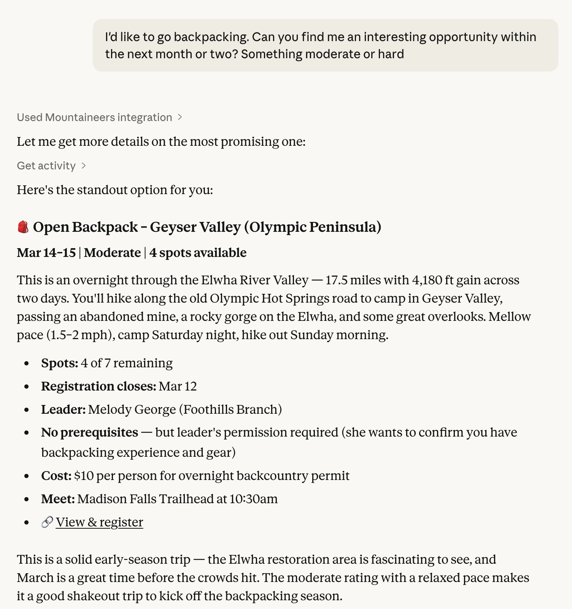

# Mountaineers MCP Server

[](https://github.com/dreamiurg/mountaineers-mcp/actions/workflows/pr.yml)
[](https://www.npmjs.com/package/mountaineers-mcp)

## What is this?

This lets AI assistants like Claude and ChatGPT search and browse [mountaineers.org](https://www.mountaineers.org) on your behalf. Instead of clicking through the website, you can ask questions in plain English:

- *"Find me a beginner-friendly day hike near Seattle this weekend"*
- *"What scrambles are available in August?"*
- *"Show me trip reports for Mount Pilchuck"*
- *"What's the elevation gain on the Mount Si trail?"*
- *"What activities am I signed up for?"*
- *"What badges have I earned?"*

The AI reads the Mountaineers website, understands the results, and gives you a conversational answer -- no manual searching required. Read the full story: [I Built an MCP Server for Mountaineers.org](https://dreamiurg.net/2026/02/06/mountaineers-mcp-server.html).

<p align="center">
  
</p>

## What can it do?

**Search public data:**
- Search activities by type, branch, difficulty, date, and more
- Search courses, clinics, and seminars
- Browse trip reports
- Search routes and places
- Get full details for any activity, trip report, route, or course

**Access your account:**
- See your upcoming and past activities
- See your completed activity history
- See your course enrollments
- View your earned badges and certifications
- View member profiles and activity rosters

## Setup

> [!IMPORTANT]
> **A one-time login is required for *all* tools, including public search.** mountaineers.org is behind Cloudflare, which blocks plain HTTP clients. After installing the server (below), just ask your assistant to **run the `login` tool** — a Chrome window opens, you sign in once on mountaineers.org, and the server caches the clearance + session cookies. Your password is typed into the real site, never into the chat or any config. See [Authentication](#authentication) for details and the requirements (desktop with Google Chrome).

Follow the instructions for your AI app below.

### Claude Desktop

1. Download `mountaineers-mcp-X.Y.Z.mcpb` from the [latest release](https://github.com/dreamiurg/mountaineers-mcp/releases/latest)
2. Open Claude Desktop → **Settings → Extensions → Install Extension**
3. Select the downloaded `.mcpb` file
4. Ask your assistant to run the **`login`** tool (one time) — a Chrome window opens, you sign in, and authentication is cached. Required before any other tool works. See [Authentication](#authentication).

<p align="center">
  
</p>

<p align="center">
  
</p>


That's it -- no Node.js setup required. Just run the one-time [Authentication](#authentication) step (the `login` tool) before using other tools.

<details>
<summary>Manual setup (alternative)</summary>

Requires [Node.js](https://nodejs.org) 18+.

1. Go to **Settings > Developer > Edit Config**
2. Paste this and save:

```json
{
  "mcpServers": {
    "mountaineers": {
      "command": "npx",
      "args": ["-y", "mountaineers-mcp"]
    }
  }
}
```

3. **Quit and reopen** Claude Desktop (not just close the window -- fully quit)

Then run the [Authentication](#authentication) step (the `login` tool). Don't add `MOUNTAINEERS_USERNAME`/`MOUNTAINEERS_PASSWORD` to this config — the server reads the cached cookie, not env vars.
</details>

### ChatGPT Desktop

ChatGPT Desktop supports MCP through [Developer Mode](https://help.openai.com/en/articles/12584461-developer-mode-apps-and-full-mcp-connectors-in-chatgpt-beta), but only **remote HTTP servers** -- it cannot run local command-line tools like Claude Desktop can. To use this server with ChatGPT Desktop, you would need to run it behind a tunnel (e.g., [mcp.run](https://mcp.run) or [ngrok](https://ngrok.com)). This is not yet streamlined; we plan to add Streamable HTTP transport in a future release.

> Requires ChatGPT Plus, Pro, Team, or Enterprise.

### Claude Code (CLI)

Run this in your terminal:

```bash
claude mcp add mountaineers -- npx -y mountaineers-mcp
```

Or add to your `.mcp.json`:

```json
{
  "mcpServers": {
    "mountaineers": {
      "command": "npx",
      "args": ["-y", "mountaineers-mcp"]
    }
  }
}
```

Then run the [Authentication](#authentication) step (the `login` tool).

### Codex CLI

Add to `~/.codex/config.toml`:

```toml
[mcp_servers.mountaineers]
command = "npx"
args = ["-y", "mountaineers-mcp"]
```

Then run the [Authentication](#authentication) step (the `login` tool).

Or use the CLI:

```bash
codex mcp add mountaineers -- npx -y mountaineers-mcp
```

## Authentication

Mountaineers.org is behind Cloudflare, which blocks plain HTTP clients — so **every** tool (public search included) needs a valid Cloudflare clearance cookie, plus a session cookie for account tools. The server doesn't log in itself; it replays cookies you mint once with a real browser.

### Recommended: the `login` tool

Just ask your assistant to run the **`login`** tool (e.g. "log in to mountaineers"). A Chrome window opens to the mountaineers.org sign-in page; **you** complete the login there (your password goes to the site, never to the chat, the server, or any config). The server then caches the cookies and every other tool works. If the browser is already signed in from a previous run, you won't need to type anything (it still takes a few tens of seconds to open Chrome, settle the session, and close).

The cookies are saved to `~/.cache/mountaineers-mcp/clearance.json` (or under `$XDG_CACHE_HOME`), owner-readable only. The server reads the cache on startup and re-reads it automatically if the clearance expires mid-session — so re-running `login` takes effect without a restart.

**Requirements:** a desktop with **Google Chrome** installed and a visible display. (Headless servers can't show the sign-in window.)

**When to re-run:** Cloudflare clearance eventually expires (lifetime is set by Cloudflare and varies). When a tool reports the clearance expired, run `login` again.

### Alternative: `npm run login` (from a checkout)

For scripted/automated setups you can mint the cache from a local checkout, auto-filling credentials from the environment:

```bash
git clone https://github.com/dreamiurg/mountaineers-mcp.git
cd mountaineers-mcp
npm install
MOUNTAINEERS_USERNAME=your-username MOUNTAINEERS_PASSWORD=your-password npm run login
```

This writes the same cache file the server reads. The credentials are used only by this command (passed as env vars, not persisted).

## Tools reference

Run `login` once before anything else (Cloudflare gates the whole site); the data tools below then work, split by the kind of data they return.

### Setup

| Tool | Description |
|------|-------------|
| `login` | Open a browser to sign in to mountaineers.org and cache the Cloudflare clearance + session cookies. Required once before any other tool; re-run when clearance expires. |

### Public data

| Tool | Description |
|------|-------------|
| `search_activities` | Search activities with filters (type, branch, difficulty, date, day of week) |
| `search_courses` | Search courses, clinics, and seminars |
| `search_trip_reports` | Search trip reports by text and activity type |
| `search_routes` | Search routes and places with filters (activity type, difficulty, climbing category) |
| `get_activity` | Get full activity details (leader notes, route, equipment) |
| `get_trip_report` | Get trip report details (conditions, route info) |
| `get_route` | Get route details (difficulty, elevation, directions, maps, related routes) |
| `get_course` | Get course details (schedule, pricing, leaders, badges earned) |

### Your account

| Tool | Description |
|------|-------------|
| `whoami` | Get your name, profile URL, and member slug |
| `get_my_activities` | Your registered activities (upcoming) with filtering |
| `get_my_courses` | Your course enrollments with filtering |
| `get_activity_history` | Your completed activity history with filtering by result, type, and date |
| `get_my_badges` | Your earned badges and certifications with dates |
| `get_member_profile` | View a member's profile, badges, and committees |
| `get_activity_roster` | See who's signed up for an activity |

## Privacy

Your credentials are used only by `npm run login` (passed as environment variables, not persisted) and are sent only to mountaineers.org. What's saved on your computer is the resulting session cookie cache (`~/.cache/mountaineers-mcp/clearance.json`, owner-readable only). Nothing — credentials or cookies — is ever sent to any AI provider or third party.

## Development

```bash
npm install
npm run dev          # Run from TypeScript sources via tsx (no build step)
npm run check        # Typecheck + lint
npm test             # Run tests
npm run ci           # Full CI: check + coverage + build
```

## Other Mountaineering & Outdoors Tools

I climb, scramble, and hike a lot, and I keep building tools around it. If this one's useful to you, the others might be too:

- **[mountaineers-assistant](https://github.com/dreamiurg/mountaineers-assistant)** -- Chrome extension that syncs your mountaineers.org activity history and shows you stats, trends, and climbing partners you can't see on the site.
- **[peakbagger-cli](https://github.com/dreamiurg/peakbagger-cli)** -- Command-line access to PeakBagger.com. Search peaks, check elevation and prominence, browse ascent stats. Outputs JSON for piping into other tools.
- **[claude-mountaineering-skills](https://github.com/dreamiurg/claude-mountaineering-skills)** -- Claude Code plugin that generates route beta reports by pulling conditions, forecasts, and trip reports from multiple mountaineering sites.

## License

MIT
